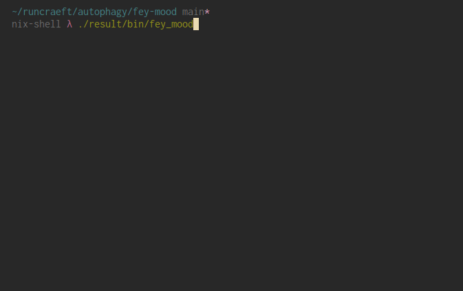

# Fey Mood



## What?

A tool to simulate being divinely inspired by a deity from Dwarf Fortress,
specifically to create a ceramic object. Uses OpenAI's `text-davinci-003` model.

Details on naming, creatures and divine spheres taken from the Dwarf Fortress
wiki:
- [Names](https://dwarffortresswiki.org/index.php/Name)
- [Creatures](https://dwarffortresswiki.org/index.php/Creature)
- [Spheres](https://dwarffortresswiki.org/index.php/Sphere)

## How?

### With Nix

```
> nix build
> export OPENAI_API_KEY="xxx"
> ./result/bin/fey_mood
```

### With Poetry

```
> poetry install
> export OPENAI_API_KEY="xxx"
> poetry run fey_mood
```

## Why?

I wanted to explore ideas around automation, labour and creative control (or
lack thereof) with regards to the generative AI models that are currently being
released. I'm an amateur ceramicist, and had an idea for a project where I
secede creative control over a pottery project to an large language model, where
I would just act as an appendage that realises the object in the real world.

Noticed that this relationship is more-or-less how the dwarves in Dwarf Fortress
must feel when they enter a strange mood. Hopefully the consequences will be
less severe if I don't fulfil the divine demands.

## Works

### #1

- **Deity**: Catten most often takes the form of a female wombatman and is associated with mercy,
  earth and peace.
- **Demand**: You must create a mug that is tall and elegant with a generous
  handle. Its body should be slightly curved, with a soft roundness, and the
  lip should be wide and slightly flared. It should be symmetrical and carefully
  balanced, standing 6 inches tall with a width of 4 inches and a depth of 4.5
  inches. Its handle should be substantial and looping, beginning at the lip
  and curving gracefully down to the bottom. The sides and exterior of the mug
  should be adorned with an intricate pattern of carved leaves, vines, and
  small animals, depicting a scene of peace and mercy.
- **Status**: Not yet started.
